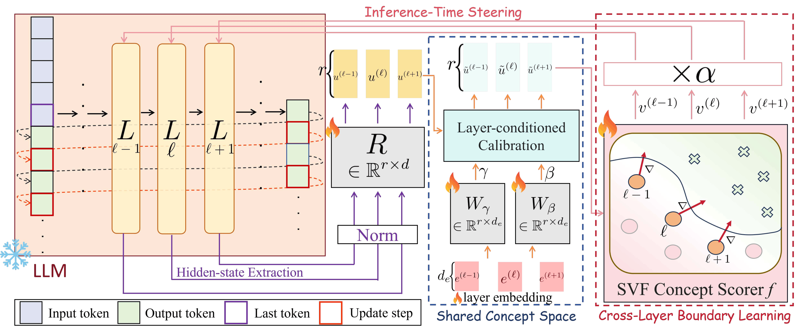

# Steering Vector Fields for Context-Aware Inference-Time Control in Large Language Models

🎉 **Accepted to EMNLP 2026 Main Conference**

This repository contains the official implementation of:

**Steering Vector Fields for Context-Aware Inference-Time Control in Large Language Models**
Jiaqian Li, Yanshu Li, and Kuan-Hao Huang
**EMNLP 2026 Main**

**Paper:** https://arxiv.org/abs/2602.01654

---

## Overview

<p align="center">
  
</p>

Steering vectors provide a lightweight way to control large language models at inference time by modifying their hidden representations. Most existing methods, however, use a fixed steering direction across different inputs.

We introduce **Steering Vector Fields (SVF)**, which learns a differentiable concept function over hidden representations and uses its local gradient as an input-dependent steering direction. This allows the intervention direction to adapt to the current context.

SVF further performs coordinated multi-layer steering through a shared representation space and a shared concept boundary.

This repository currently provides the implementation for the **multiple-choice question (MCQ) setting** used in our experiments. Implementations for additional settings are coming soon.


## Setup

Clone the repository:

```bash
git clone https://github.com/lab-flair/SVF.git
cd SVF
```

We recommend using a separate Python environment:

```bash
conda create -n svf python=3.10
conda activate svf
```

Install the required dependencies:

```bash
pip install torch transformers datasets accelerate pyyaml tqdm numpy
```

The default configuration uses `meta-llama/Llama-2-7b-chat-hf`. Please make sure that you have access to the corresponding Hugging Face model before running the experiments.

---

## Train SVF

To train the shared SVF boundary, run:

```bash
python -m vfc.train_svf_shared_boundary --cfg ./configs/config_train_svf.yaml
```

The training settings are specified in:

```text
configs/config_train_svf.yaml
```

This stage constructs the positive and negative examples for the target concept, collects hidden representations from multiple transformer layers, and trains the shared layer-aware SVF boundary.

Instead of learning a separate steering vector for each layer, SVF projects representations from different layers into a shared space and learns a common differentiable concept function.

Given the hidden representation \(h_l\) at layer \(l\), we denote the learned concept score as

$$
F(h_l, l).
$$

The corresponding context-dependent steering direction is obtained from the local gradient

```math
v_{\mathrm{SVF}}(h_l, l) = \nabla_{h_l} F(h_l, l)
```

As a result, the steering direction changes according to the current hidden representation rather than remaining fixed across inputs.

The trained boundary is saved to the output directory specified by `out_dir` in the configuration file. With the default configuration, the checkpoint is stored at:

```text
./artifacts/shared_bndry/wealth/shared_boundary.pt
```

---

## Evaluate SVF

After training the shared boundary, run:

```bash
python eval_svf.py --cfg ./configs/config_eval_svf.yaml
```

The evaluation settings are specified in:

```text
configs/config_eval_svf.yaml
```

During evaluation, the trained shared boundary is loaded and used to compute context-dependent steering directions from the current hidden representations.

The evaluation configuration controls the model, target concept, intervention layers, number of selected layers, steering strength, and the path to the trained SVF checkpoint.

For example:

```yaml
vfc:
  enable: true
  shared_boundary_path: ./artifacts/shared_bndry/wealth/shared_boundary.pt
  layers: [15, 16, 17, 18]
  top_k: 4
  alpha: 200
  margin_gate: 0.0
```

`shared_boundary_path` should point to the checkpoint obtained from the training stage. `layers` specifies the candidate intervention layers, `top_k` controls how many layers are selected for steering, and `alpha` controls the intervention strength.

---

## Running the Full Pipeline

The basic MCQ pipeline is:

```bash
python -m vfc.train_svf_shared_boundary --cfg ./configs/config_train_svf.yaml

python eval_svf.py --cfg ./configs/config_eval_svf.yaml
```

The first command trains the shared layer-aware concept boundary. The second command loads the trained boundary and performs SVF steering during MCQ evaluation.

When using a different target concept or dataset, make sure that the training and evaluation configurations are consistent and that the evaluation configuration points to the correct trained checkpoint.

---

## CAA Baseline

The repository also includes the CAA baseline used in our experiments.

The corresponding configurations are:

```text
configs/config_compute_caa.yaml
configs/config_eval_caa.yaml
```

and the evaluation entry point is:

```text
eval_caa.py
```

---

## Citation

If you find this work useful, please cite:

```bibtex
@inproceedings{li2026steering,
  title     = {Steering Vector Fields for Context-Aware Inference-Time Control in Large Language Models},
  author    = {Li, Jiaqian and Li, Yanshu and Huang, Kuan-Hao},
  booktitle = {Proceedings of the 2026 Conference on Empirical Methods in Natural Language Processing},
  year      = {2026}
}
```
